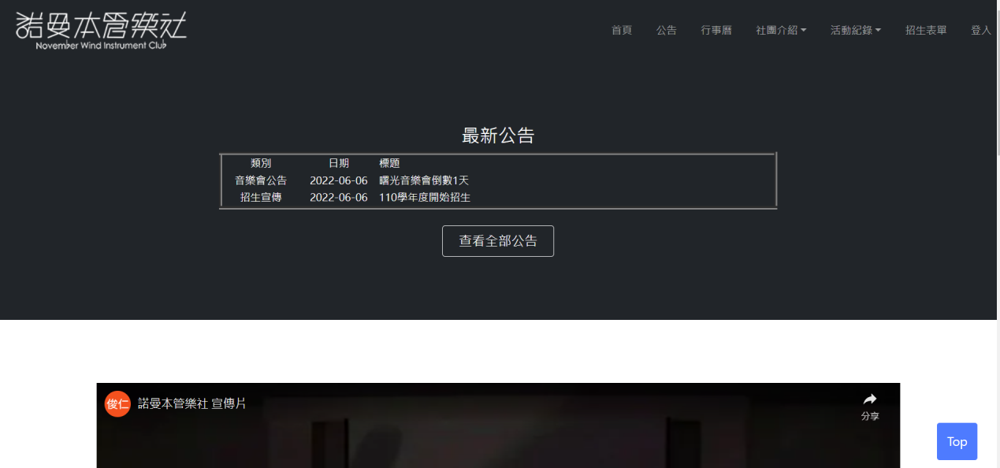

<h2>系統還原步驟</h2>

<ol>
<li>開啟Cmder，輸入以下指令（以克隆、進入專案資料夾）：
<pre>
git clone https://github.com/3A832061/topic.git
cd topic
</pre>
</li>
<li>
復原專案
<pre>
composer install
composer run‐script post‐root‐package‐install
composer run‐script post‐create‐project‐cmd
</pre>
</li>
<li>
打開.env（<code>/topic/.env</code>）檔案，修改以下資料：
<pre>
DB_PORT=33060
DB_DATABASE=topic
DB_USERNAME=root
DB_PASSWORD=root
</pre>
</li>
<li>
開啟PHPMyAdmin，建立名稱為topic的資料庫
</li>
<li>
於Cmder中，輸入以下指令：
<pre>
php artisan migrate
</pre>
</li>
<li>
選擇wisd01.sql（<code>/topic/sql/topic.sql</code>）檔案，將資料匯入資料庫
</li>
<li>
在UwAmp下，點選Apache config，選擇port:8000，並於Document Root 輸入：
<pre>
{DOCUMENTPATH}/final10/public
</pre>
</li>
</ol>

<h2>關聯式綱要圖</h2>

<h2>欄位設計</h2>

<h3>社團資訊</h3>

<h3>公告</h3>

<h3>譜</h3>

<h3>使用者</h3>

<h3>活動紀錄</h3>

<h3>獎項紀錄</h3>

<h3>儲存於Google試算表的資料</h3>

<h1>系統介面</h1>

<h2>前端介面</h2>
<h3>首頁</h3>

在網站首頁便能看到最新公告，若要了解詳細可直接點選公告標題，即進入公告細項頁面。

<h3>所有商品</h3>

<h3>商品分類</h3>

<h3>商品詳細資訊</h3>

<h3>購物車畫面</h3>

<h3>結帳畫面</h3>

<h3>會員中心－訂單查詢</h3>

<h3>會員中心－訂單詳細資訊</h3>

<ol>

</ol>
<h2>後端介面</h2>
<h3>管理中心畫面</h3>

<h3>管理中心－商品管理</h3>

<h3>商品管理－新增商品</h3>

<h3>商品管理－修改商品</h3>

<h3>訂單管理－訂單檢視</h3>

<h2>系統主要功能</h2>

<h3>使用者：</h3>
<ol>
<li>使用者瀏覽公告類別</li>
<li>使用者瀏覽公告的詳細資訊</li>
<li>使用者瀏覽招生資訊</li>
<li>使用者填寫招生表單</li>
<li>使用者瀏覽社團簡介</li>
<li>使用者瀏覽指導老師</li>
<li>使用者瀏覽獎項紀錄</li>
<li>使用者瀏覽組織章程</li>
<li>使用者瀏覽組織架構</li>
<li>使用者瀏覽活動紀錄</li>
</ol>

<h3>社員：</h3>
<ol>
<li>社員修改社員資料</li>
<li>社員重設密碼</li>
<li>社員瀏覽存譜總清單</li>
<li>社員瀏覽音樂會歷年演奏曲目清單</li>
<li>社員瀏覽樂譜缺頁申請單一覽頁面</li>
<li>社員填寫樂譜缺頁申請單</li>
<li>社員瀏覽社員清單</li>
<li>社員查看社費收支</li>
<li>社員瀏覽每月出席統計</li>
<li>社員填寫每月出席表單</li>
<li>社員登出</li>
</ol>

<h3>幹部：</h3>
<ol>
<li>幹部刪除公告</li>
<li>幹部新增招生介紹</li>
<li>幹部修改招生介紹</li>
<li>幹部新增日程</li>
<li>幹部刪除日程</li>
<li>幹部新增指導老師</li>
<li>幹部修改指導老師</li>
<li>幹部刪除指導老師</li>
<li>幹部新增社團介紹</li>
<li>幹部修改社團介紹</li>
<li>幹部瀏覽歷年社團評鑑紀錄</li>
<li>幹部新增歷年社團評鑑紀錄</li>
<li>幹部修改歷年社團評鑑紀錄</li>
<li>幹部新增活動紀錄</li>
<li>幹部修改活動紀錄</li>
<li>幹部刪除活動紀錄</li>
<li>幹部新增獎項紀錄</li>
<li>幹部修改獎項紀錄</li>
<li>幹部刪除獎項紀錄</li>
<li>幹部查看各項活動注意事項</li>
<li>幹部新增各項活動注意事項</li>
<li>幹部修改各項活動注意事項</li>
<li>總務新增社費帳目</li>
<li>總務刪除社費帳目</li>
<li>幹部新增存譜總清單</li>
<li>幹部修改存譜總清單</li>
<li>幹部刪除存譜總清單</li>
<li>幹部新增音樂會歷年演奏曲目清單</li>
<li>幹部修改缺頁申請單狀態</li>
<li>幹部刪除缺頁申請單</li>
<li>幹部新增組織章程</li>
<li>幹部修改組織章程</li>
<li>幹部刪除組織章程</li>
<li>幹部新增組織架構</li>
<li>幹部修改組織架構</li>
<li>幹部刪除組織架構</li>
<li>幹部新增社員帳號</li>
<li>幹部修改社員權限</li>
</ol>

<h2>系統使用帳號</h2>
<li>會員-帳號：<code>456@456</code>，密碼：<code>12345678</code></li>

<li>平台人員-帳號：<code>123@123</code>，密碼：<code>12345678</code></li>

<h2>系統開發人員</h2>
<li><a href="https://github.com/3A832061">3A832061 莊怡萱</a></li>

<li><a href="https://github.com/3A832098">3A832098 郭芷伶</a></li>
